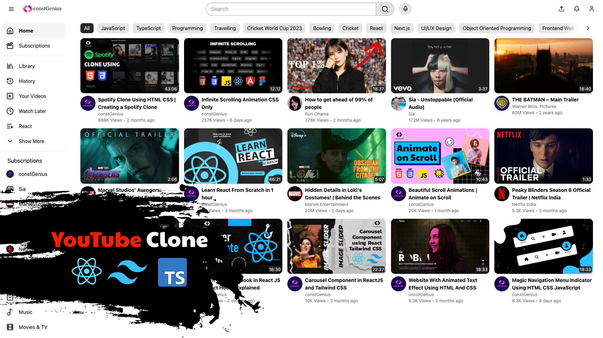

# Youtube Clone with React Tailwind and TypeScript in Hindi | Youtube Clone Step by Step

Youtube Tutorial Link: https://youtu.be/TYP_j74A2P8

The YouTube Home Page Clone with React, Tailwind CSS, and TypeScript is a focused project that recreates the iconic landing page of the YouTube platform. Leveraging the power of React for dynamic UI components, Tailwind CSS for rapid and responsive styling, and TypeScript for type-safe code, this clone provides developers with an opportunity to dissect and recreate the familiar YouTube home page experience.

Developers can explore the intricacies of building a dynamic video grid, implementing features such as video thumbnails, titles, and view counts. The responsive design, facilitated by Tailwind CSS, ensures that the clone adapts seamlessly to various screen sizes, providing an authentic user experience.

By concentrating on the home page aspect, this project allows developers to delve into the core functionalities of a widely-used platform, honing their React skills while incorporating the benefits of TypeScript for a more robust codebase. Whether you're a beginner looking to grasp fundamental concepts or an experienced developer aiming to enhance your React proficiency, this YouTube Home Page Clone provides a focused and practical learning experience.
